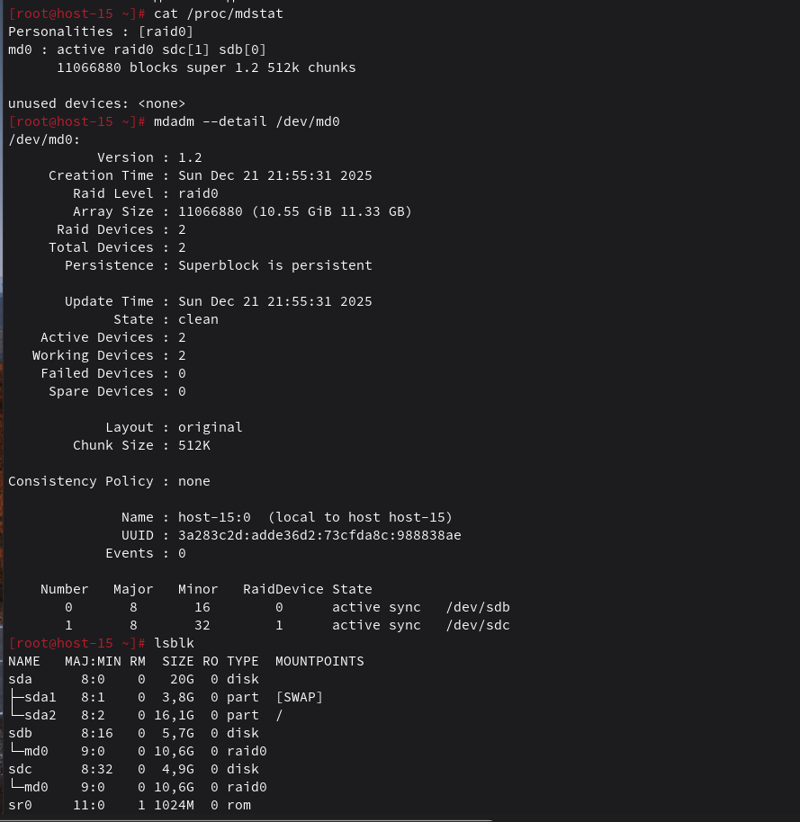

# Продолжаем

1. Raid массивы, что такое икакие бывают
   - RAID - технология объединения нескольких физических дисков в один логический модуль для повышения отказоустойчивости или производительности
   - Основные уровни: RAID 0 (Striping), RAID 1 (Mirroring), RAID 5 (Striping with Parity), RAID 6 (Double Parity), RAID 10 (1+0)

2. Добавьте в виртуальную машину 2 диска отформатируйте их в ext4
   - Добавил диски в настройках виртуалки
   - sudo mkfs.ext4 /dev/sdb
   - sudo mkfs.ext4 /dev/sdc

3. Создайте из них raid 0 массив
   - sudo mdadm --create --verbose /dev/md0 --level=0 --raid-devices=2 /dev/sdb /dev/sdc

4. Проверье всё ли работает
   - проверил: cat /proc/mdstat
   - проверил детально: sudo mdadm --detail /dev/md0
   

5. Удалите raid0 и создайте raid1
   - остановил: sudo mdadm --stop /dev/md0
   - зачистил суперблоки: sudo mdadm --zero-superblock /dev/sdb /dev/sdc
   - создал raid1: sudo mdadm --create --verbose /dev/md0 --level=1 --raid-devices=2 /dev/sdb /dev/sdc
    
    п.с. он потом до конца засинхронизировался

6. В чём между ними разница?
   - RAID 0 распределяет данные по дискам (чередование), увеличивая скорость, но при выходе из строя одного диска теряются все данные
   - RAID 1 дублирует данные (зеркалирование), обеспечивая высокую надежность: если один диск сломается, система продолжит работу на втором

7. Есть ли файловые системы которые поддерживают raid массивы без стороненго ПО
   - да, это Btrfs и ZFS - они умеют объединять диски в массивы на уровне самой файловой системы

8. Можно ли создать raid массив во время установки системы?
   - да, можно настроить программный RAID на этапе разметки дисков
