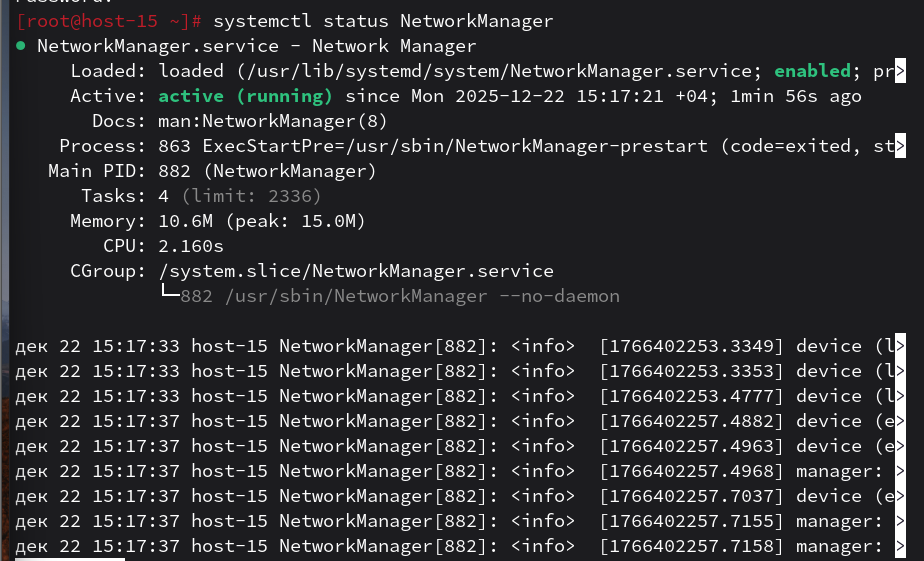
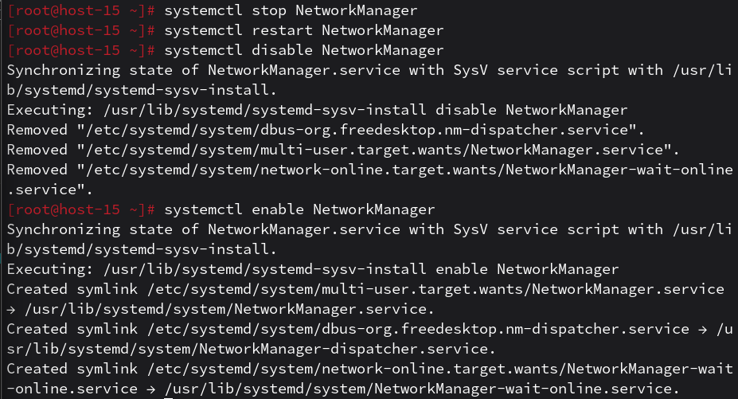

# Юниты

1. Что такое systemd юнит?
     - это конфигурационный файл, который описывает объект, которым умеет управлять система (служба, точка монтирования, устройство или таймер). Это «кирпичик» системы, через который Linux понимает, как и в каком порядке запускать программы

2. Проверье статус любого systemd юнита, какую информацию выводит эта кманда?
    - выполнил команду `systemctl status NetworkManager`. Она выводит состояние (активен/выключен), PID процесса, потребление памяти и последние записи в логах
    

3-6. Все действия (stop, restart, disable, enable) выполнены успешно:
- Остановка: `systemctl stop NetworkManager`
- Перезапуск: `systemctl restart NetworkManager`
- Управление автозагрузкой: `systemctl disable` и `systemctl enable`
    

7. Что такое таймеры?
    - это юниты systemd, предназначенные для запуска служб по расписанию или определенным событиям во времени
    