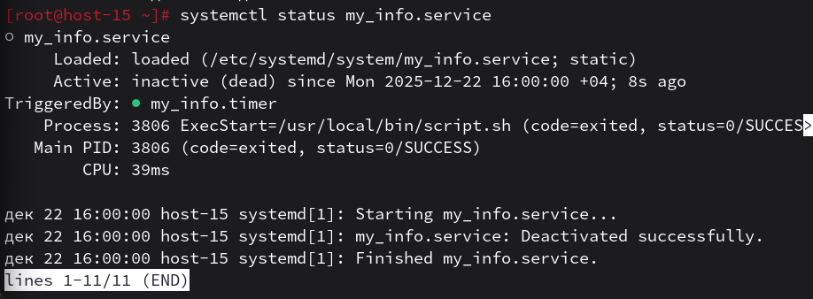
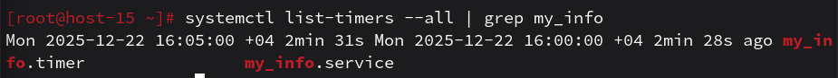
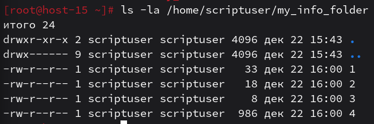

# Пишем юниты

1. Создайте скрипт который создаёт папку заполняет её файлами ( имена 1-4 ) и записывает в них информацию о текущей дате, версии ядра, имени компьютера и списе всех файлов в домашнем каталоге пользователя от которого выполняется скрипт( не забудьте сдлеать проверку на существование файлов и папок)
    - написан скрипт /usr/local/bin/script.sh с проверкой директории и сбором данных

    #!/bin/bash
    set -euo pipefail
    cd "$HOME"
    TARGET="my_info_folder"
    [ -d "$TARGET" ] || mkdir "$TARGET"
    date > "$TARGET/1"
    uname -r > "$TARGET/2"
    hostname > "$TARGET/3"
    ls -la ~ > "$TARGET/4"

2. Создайте юнит который будет вызывать этот скрипт при запуске.Проверьте
    - создан файл сервиса /etc/systemd/system/my_info.service

    [Service]
    Type=oneshot
    User=scriptuser
    ExecStart=/usr/local/bin/script.sh
    

3. Создайте таймер который будет вызывать выполнение одноимённого systemd юнита каждые 5 минут.
    - создан файл таймера /etc/systemd/system/my_info.timer
    [Timer]
    OnCalendar=*:0/5
    Unit=my_info.service
    [Install]
    WantedBy=timers.target
    

4. От какого пользователя вызыаются юниты поумолчанию?
    - системные юниты по умолчанию вызываются от пользователя root

5. Создайте пользователя от имени которого будет выполняться ваш скрипт.
    - пользователь scriptuser создан командой useradd -m scriptuser

6. Дополните юнит информацией о пользователе от которого должен выплняться скрипт.
    - в юнит добавлена строка User=scriptuser, проверка прав созданных файлов подтверждает корректность настройки
    

7. Дополните ваш скрипт так, что бы он независимо от местоположения всега выполнялся в домашней папке того кто его вызывает.
    - в код скрипта добавлена команда cd "$HOME", которая принудительно переносит рабочую область в домашний каталог владельца процесса
