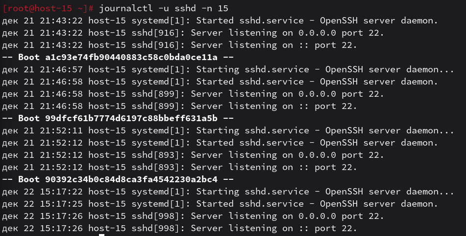
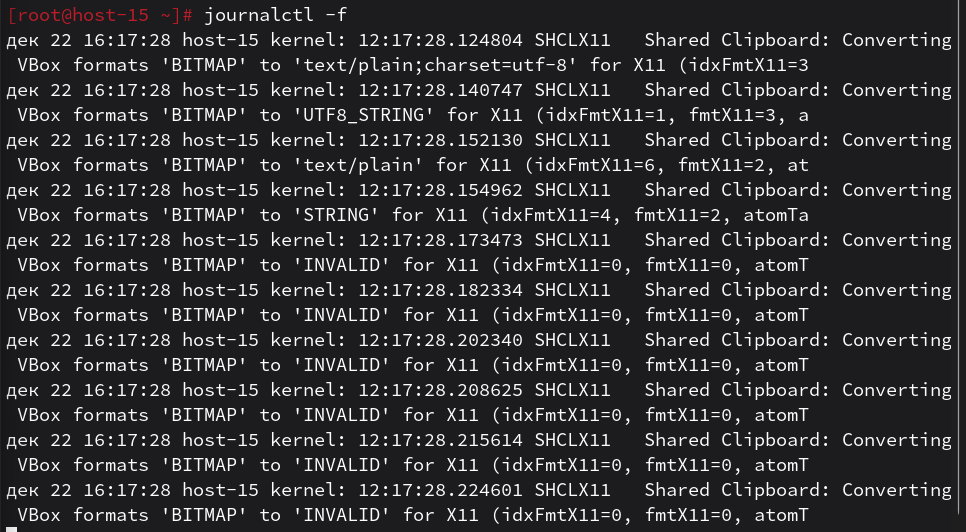
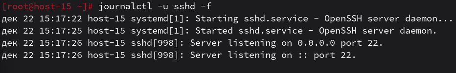

# Журнальчики

1. Посмотретите журналы ssh
    - выполнил команду journalctl -u sshd -n 15(последние 15 штук дял наглядности) для просмотра истории событий службы удаленного доступа
    

2. Выведите журналы в реальном времени
    - использовал команду journalctl -f, которая позволяет наблюдать за новыми событиями в системе по мере их появления
    

3. Выведите лог в реальном времени для службы sshd
    - применил команду journalctl -u sshd -f для фильтрации вывода в реальном времени только по конкретному юниту
    

4. Можно ли без комады journalctl прочитать логи systemd?
    - да, это возможно, если в системе настроен демон rsyslog, который дублирует сообщения в текстовые файлы в папке /var/log/ (например, в /var/log/syslog или /var/log/auth.log). Однако сами файлы journald хранятся в бинарном формате в /var/log/journal/ и не читаются обычным текстовым редактором
    
5. Сколько будет 2-2?
    - ?
    - zero? 0? :)