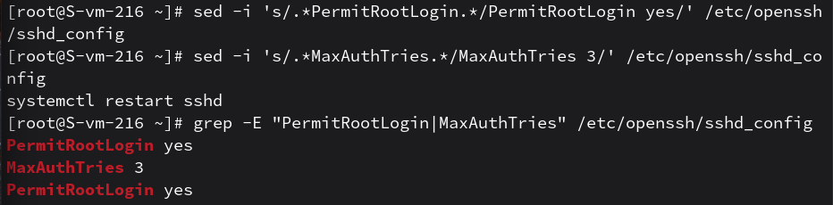
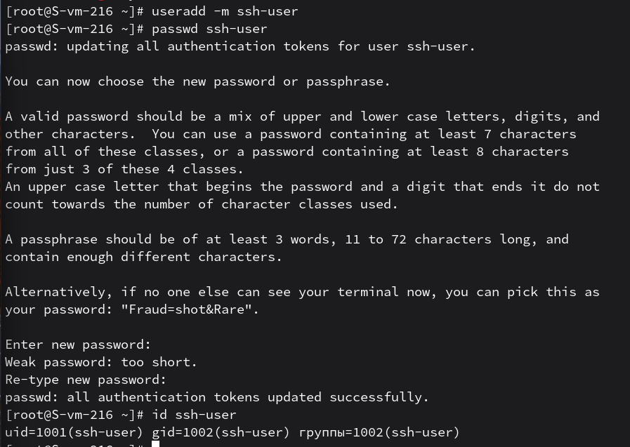
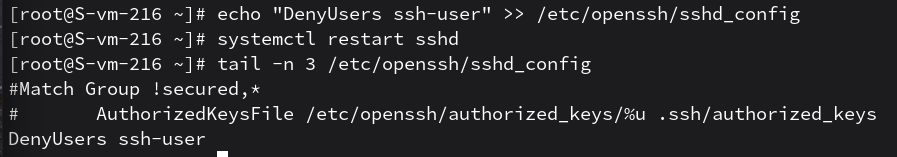

# Настриваем

1. Какой по умолчанию используется порт для поключения?
    - по умолчанию для протокола SSH используется порт 22

2. Можно ли его изменить? если да то как?
    - да, порт можно изменить в файле конфигурации /etc/ssh/sshd_config, раскомментировав строку Port и указав новое значение (например, Port 2222), после чего нужно перезапустить службу

3. Какая служба отвечает за обработку запросов на подключения по ssh?
    - за обработку запросов отвечает демон (служба) sshd

4. Какой файл конфигурации отвечает за его настройку?
    - основной файл конфигурации сервера — /etc/ssh/sshd_config

5. Попробуйте подключиться по ssh к предоставленному вам серверу
    - подключение выполнено успешно с помощью ssh student@ternar.io -p 216 (т к в ипсилоне 16 номер)

6. Отредактируйте файл настроек на сервере так, чтобы была возможность подключиться к серверу используя пользователя root
    - в конфиге установил директиву PermitRootLogin yes. Теперь доступ для root разрешен

7. Измените колличество ошибок ввода пароля перед сборосом соединения, покажите эти измененения
    - установил параметр MaxAuthTries со значением 3
    на скрине результат 6 и 7 пункта:
    

8. Создайте пользователя ssh-user и попробуйте им подключиться к серверу
    - пользователь создан командами useradd и passwd
    

9. Ограничте ему возможность подключения к серверу
    - доступ ограничен через "черный список" в настройках службы sshd

10. Как вы это сделали?
    - в конец файла /etc/openssh/sshd_config добавлена строка DenyUsers ssh-user
    

11. Что хранится в файле known_hosts?
    - в этом файле хранятся публичные ключи серверов для идентификации хоста при повторных подключениях и защиты от атак типа Man-in-the-Middle
    