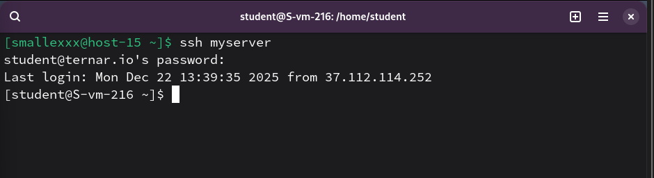

# Конфижим для удобства

1. Где хранятся пользвательские и системные настройки подключения?
    - пользовательские настройки хранятся в домашнем каталоге по адресу ~/.ssh/config, а системные настройки для всех пользователей - в файле /etc/ssh/ssh_config

2. Что за файл options?
    - конфигурационный файл клиента (config), в котором описываются параметры (опции) подключения к конкретным хостам, такие как Port, User, HostName и IdentityFile

3. Отредактируйте файл options так, чтобы можно было подключаться не вводя имя пользвателя и порт
    - настройки добавлены в файл ~/.ssh/config след. блоком:
    Host myserver
    HostName ternar.io
    User student
    Port 216

4. Назовите подключение удобным для вас спсобом
    - назвал как myserver

5. Проверьте работоспособность

    
    