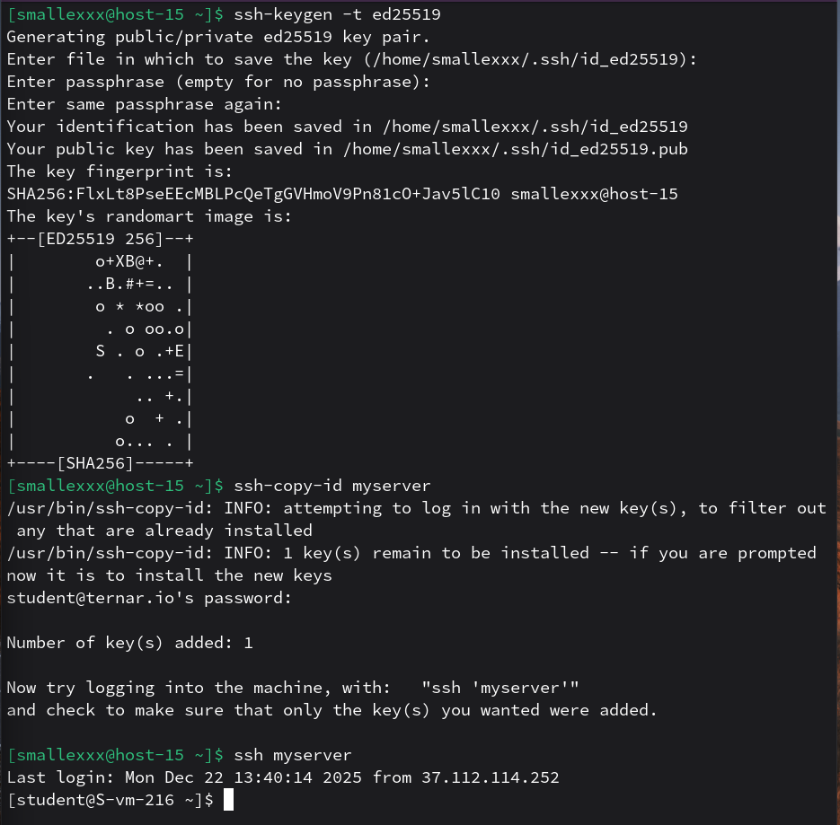
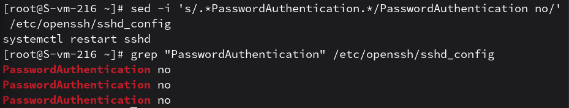

# Ключики

1. Что такое ssh ключи и зачем они нужны?
    - это пара криптографических ключей (публичный и приватный), которые используются для безопасной аутентификации пользователя без необходимости вводить пароль. Это значительно повышает безопасность, так как ключи практически невозможно подобрать перебором

2. Как их создать? 
    - ключи создаются с помощью утилиты ssh-keygen в терминале локальной машины

3. Создайт пару публичный/приватный ключ ed_25519, где они хранятся?
    - пара создана командой ssh-keygen -t ed25519. По умолчанию они хранятся в папке ~/.ssh/: приватный ключ - в файле id_ed25519, публичный - в id_ed25519.pub

4. Скопируйте публичный ключ на ваш сервер, в каком файле он будет храниться?
    - ключ скопирован командой ssh-copy-id. На стороне сервера он записывается в файл ~/.ssh/authorized_keys в домашней директории пользователя
5. Попробуйте подключиться к серверу, у вас запросили пароль?
    - после настройки ключей подключение выполняется автоматически без запроса пароля
    

6. Запретите подключение с паролем для всех пользователей, оставьте только с помощью ключа.
    - в конфигурационном файле сервера значение параметра PasswordAuthentication изменено на no
    
    