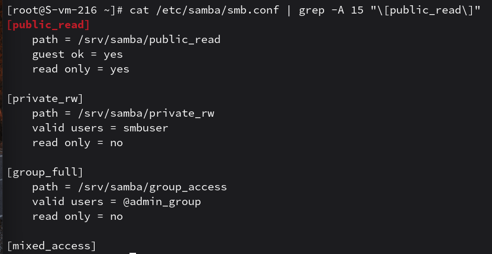
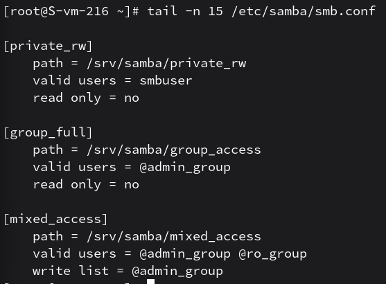

# Шарим

1. Установите пакет samba
    - установил apt-get install samba для работы файлового сервера

2. ЧТо такое побщая папка, зачем оно может быть нужно?
    - это директория на сервере, доступная другим пользователям через сеть. Она нужна для централизованного хранения файлов и обмена данными между разными ОС (Linux, Windows, macOS)

3. Создайте общую папку без пароля с правами только на чтение файлов
    - в конфигурационном файле создан ресурс с параметрами guest ok = yes и read only = yes
    п.с. скрин в 4 пункте

4. Создайте общую папку с паролем с правами на чтение и запись
    - настроен закрытый ресурс, где read only = no, а доступ разрешен только авторизованному пользователю

    

    п.с тут и public_read для 3 пункта и private_rw для 4

5. Создайте общую папку с доступом для какой-то группы с полными правами
    - доступ к ресурсу ограничен директивой valid users = @smbgroup, где группа имеет права на запись
    п.с. смотреть group_full с скрина под 6 пунктом

6. Создайте общую папку в которой у одной группы будет полный доступ, а у другой только доступ на чтение. Третья группа не должна иметь к ней доступа
    - реализовано через разграничение прав: write list для группы с полным доступом и valid users для обеих разрешенных групп. Все остальные группы игнорируются
    
    

    п.с смотреть mixed_access
