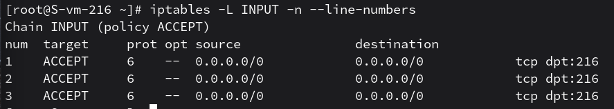
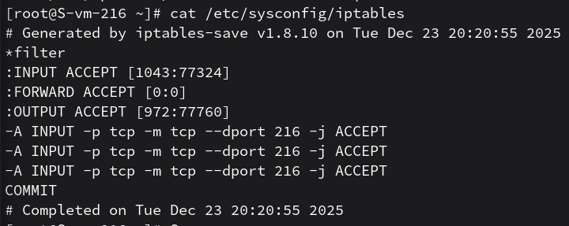

# Открываем iptables

1. Установите iptables
    - установкил с помощью apt-get install iptables

2. Проверьте осталась ли возможность подключения по ssh к вашему серверу
    - да, все получилось

3. Почему может пропасть такая возможность?
    - возможность подключения пропадает, если в цепочке INPUT нет разрешающего правила для порта SSH или если политика по умолчанию запрещает все входящие пакеты

4. Откройте нужный порт на сервере чтобы восстановить подключение
    - для восстановления доступа добавлено разрешающее правило: iptables -A INPUT -p tcp --dport 216 -j ACCEPT
    

5. Это будет udp или tcp прот?
    - tcp, т к протокол SSH работает через него

# Сохраняем

6. Сохраняются ли записанные вами правила после перезагрузки?
    - нет, правила iptables хранятся в оперативной памяти и сбрасываются после перезагрузки сервера

7. Как их сохранить?
    - сохранение выполнено путем выгрузки текущих правил в системный файл конфигурации /etc/sysconfig/iptables с помощью утилиты iptables-save
    
    
