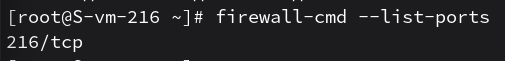
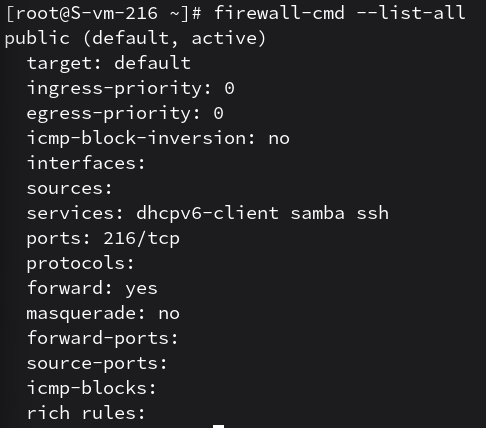

# Открываем firewald

1. Удалите iptables и установите firewalld
    - удалил ремувом apt-get remove iptables, установка — apt-get install firewalld

2. Попробуйте так-же проверить возможность подключения по ssh
    - после запуска службы firewalld новое подключение может быть сброшено, если порт 216 не добавлен в разрешенные зоны

3. Если её нет то откройте порт
    - порт открыл командой firewall-cmd --add-port=216/tcp

4. Выведите список открытых портов с помощью firewall-cmd
    - список вывел firewall-cmd --list-ports
    

5. Можно ли там добавить порты по названию сервиса?
    - да, это делается через параметр --add-service. ну унас для SSH используется команда firewall-cmd --add-service=ssh

6. На вашей Локальной виртуальной машине попробуйте подключиться к серверу samba из предыдущих заданий
    - не получается до открытия соответствующих портов

7. Если не получилось то откройте нужные порты
    - открыл через сервис: firewall-cmd --add-service=samba

9. Сделайте так чтобы изменения были постоянными
    - для сохранения настроек после перезагрузки ко всем командам добавил флаг --permanent, после чего перезагрузил правила прописав релоад firewall-cmd --reload
    
    на скрине видно, что в постоянных по серверу 216 с сервисах стоит самба ссх
