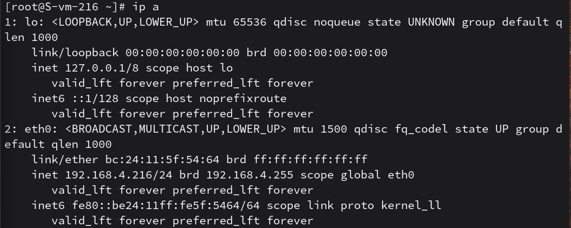
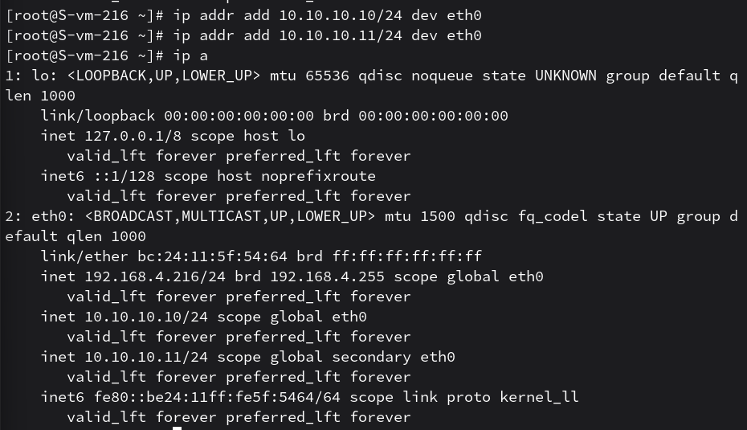
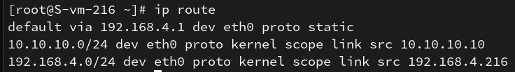
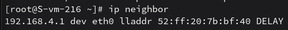

# сети

1. Выведите список интерфейсов, какими способами можно это сделать?
    -  можно вывести с помощью  ip address ( сокращенно ip a), ifconfig (при пакете net-tools) или через просмотр системного файла /proc/net/dev
    

2. Попробуйте изменить ip адрес
    - изменил с помощью  ip addr add для конкретного интерфейса

3. Попробуте добавить несколько ip адресов на сетевую карту
    - на один интерфейс добавил парочку доп адресов (алиасов) командой ip addr add, что позволяет серверу отвечать по нескольким IP одновременно
    
    на eth0 добавил доп адреса 10.10.10.10/24 и 10.10.10.11/24

4. Выведите список маршрутов
    - выведен командой ip route(еще можно route -n) 
    

5. Выведите arp таблицу
    - вывел командой ip neighbor (или можно ip n или arp -n)
    
    
6. Что такое ip адрес?
    - уникальный числовой идентификатор устройства в компьютерной сети, работающей по протоколу IP

7. Для чего нужны маршруты?
     - маршруты определяют путь следования пакетов данных между разными сетями и указывают, на какой шлюз (роутер) отправить пакет, если цель находится за пределами текущей подсети

8. Что за протокол arp?
    - протокол (Address Resolution Protocol) служит для определения физического адреса (MAC-адреса) устройства по его известному IP-адресу в рамках одной локальной сети

9. Что такое dhcp?
     - протокол автоматической конфигурации узла, который позволяет устройствам динамически получать IP-адрес, маску и другие параметры сети от сервера

10. Что такое dns?
    - система доменных имен, которая преобразует понятные человеку имена сайтов в числовые IP-адреса, понятные компьютерам

11. Как называется один из протоколов синхронизации времени?
    - какой? ну самый популярный наверно NTP(Network Time Protocol)

12. Что такое широковещательный запрос, зачем он нужен?
    - это пакет, предназначенный всем устройствам в текущем сегменте сети. Нужен для поиска ресурсов или оповещения о своем присутствии

13. Какой адресс является широковещательным?
     - на сетевом уровне это адрес, у которого в части хоста стоят все единицы 

14. Какие ещё параметры можно задать сетевой карте?
    - маску подсети, шлюз по умолчанию, DNS-серверы, MTU (максимальный размер пакета), MAC-адрес и скорость работы 

15. Что такое маска подсети? зачем она нужна?
    - битовая маска, которая разделяет IP-адрес на две части: адрес самой сети и адрес конкретного устройства (хоста) внутри этой сети
